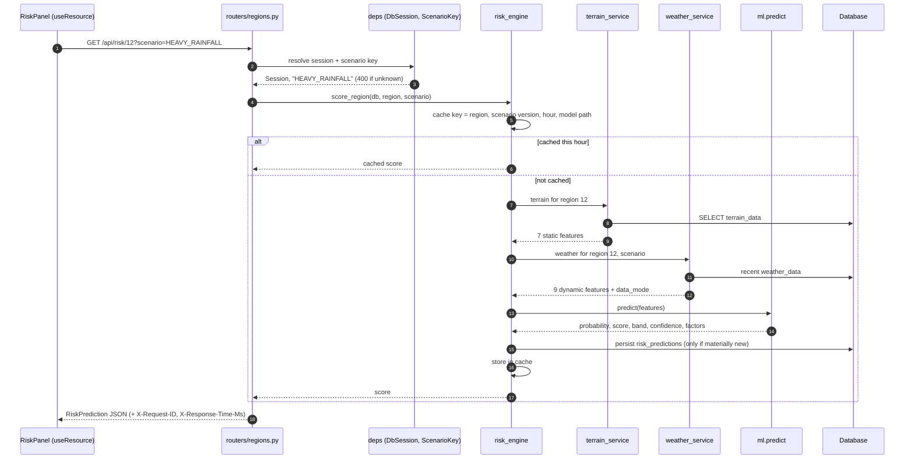

# Architecture

Bhoomi-Drishti is four things stacked: a React command centre, a FastAPI service, a
set of Python services around one risk engine, and an ML package that can be
trained, tested and replaced on its own. Between them sits a database in which
every derived row records where it came from.

## In one picture

```
┌───────────────────────────────────────────────────────────────────────────────┐
│ Browser                                                                       │
│   React 18 · TypeScript 5.7 · Vite 6 · Tailwind 3 · Leaflet 1.9 · Recharts 2  │
│                                                                               │
│   pages/           11 screens, each a composition of panels                   │
│   state/           PlatformContext — scenario, health, auth, version bus       │
│                    useResource — fetch, loading, error, abort, per panel       │
│   services/api.ts  the only module in the app that touches the network        │
│   types/api.ts     every response shape, mirroring backend/app/schemas.py      │
└────────────────────────────────┬──────────────────────────────────────────────┘
                                 │ JSON over HTTP · one error shape · bearer token
                                 │ dev: Vite proxies /api and /uploads to :8000
┌────────────────────────────────▼──────────────────────────────────────────────┐
│ FastAPI — backend/app                                                         │
│   main.py      CORS · request id and timing · one JSON error shape · /uploads  │
│   routers/     12 routers: validate, resolve the role, call exactly one service│
│   security.py  PBKDF2 hashes · HS256 tokens · citizen < officer < administrator│
│   schemas.py   Pydantic request and response models                           │
├───────────────────────────────────────────────────────────────────────────────┤
│ Services — where the logic lives                                              │
│                                                                               │
│    terrain_service ──┐                              ┌── alert_service         │
│    weather_service ──┼──►   risk_engine   ──────────┼── forecast_service      │
│    scenario ─────────┘  the only place a score      └── whatif_service        │
│    sensor_simulator     is ever produced                  overview_service    │
│    report_service · image_analysis · history_service                          │
└───────────────┬───────────────────────────────────────────┬───────────────────┘
                │ SQLAlchemy 2.0                            │ import ml
┌───────────────▼───────────────────┐   ┌───────────────────▼───────────────────┐
│ Database                          │   │ ml/ — an independent package          │
│   SQLite file (default)           │   │   features.py    the feature contract │
│   or PostgreSQL 16 + PostGIS 3.4  │   │   preprocess.py  raw inputs → matrix  │
│   10 tables; every derived row    │   │   predict.py     score + confidence   │
│   carries a data_mode label       │   │   explain.py     additive attribution │
└───────────────────────────────────┘   │   physics.py     labels and fallback  │
                                        │   model.pkl      5-member GBM         │
                                        └───────────────────┬───────────────────┘
                                                            │ LIVE mode only
                                                   ┌────────▼─────────┐
                                                   │  Open-Meteo API  │
                                                   └──────────────────┘
```

## One rule shapes the whole backend

There is exactly one function in this codebase that turns conditions into a
number, and everything that shows a risk score goes through it.

The map, the region detail panel, the 72-hour forecast, the what-if simulator,
the national overview, the alert sweep and the scenario buttons all end up
calling `risk_engine.score_features` or one of its wrappers. None of them
computes a score of its own, none of them adjusts a score afterwards, and none
of them has a hardcoded number to fall back on.

That is worth insisting on for three reasons. A score shown on the map and the
same score shown in an alert can never disagree, because they are the same
score. An explanation can never contradict the number it explains, because both
come out of one call. And when the model is retrained, every screen changes
together — there is nowhere for an old number to survive.

The engine is also the only importer of the `ml` package. `backend/app/services/
risk_engine.py` calls `ensure_ml_importable()` and then
`from ml.predict import model_info, predict as ml_predict`. No router, and no
other service, imports `ml` directly. So the ML package can be rewritten,
retrained in a different framework, or moved behind a network call, and exactly
one file in the backend has to change.

Its public surface is deliberately small:

```
assemble_features   gather the 16 features for a region, now
score_features      features → score, band, confidence, explanation
score_region        assemble + score, with the cache
score_regions       the same for many regions, one pass
score_and_store     score, then persist if the row is materially new
persist             write a risk_predictions row
latest_prediction   read the most recent stored row
band_counts         how many regions sit in each band
summarise           the national roll-up
regions_query       the shared region selector
risk_level          score → band name (the single source of the thresholds)
model_card          the model's own metrics, as trained
model_status        is a real model loaded, or are we in physics fallback
reset_cache         drop cached scores (used when the scenario changes)
```

## The life of one request

`GET /api/risk/12` — the region detail panel. This is the path that touches the
most layers, so it is the one worth following.



Four things in that diagram carry design weight.

The router does three things and stops: validate the path, resolve the session
and scenario through dependencies, call one service. `region_from_path` accepts
either an id or a region code, so `/api/risk/12` and `/api/risk/WYD` are the same
request. If the router grew a fourth responsibility it would be the place where
two screens started to disagree.

The scenario arrives as a dependency, not as a global read inside the service.
`ScenarioKey = Annotated[str, Depends(active_scenario)]` means a `?scenario=`
query parameter overrides the process-wide active scenario for that one request,
and an unrecognised key is a 400 rather than a silent fall back to normal. The
what-if simulator relies on this: it can ask "what would this region look like
under extreme rainfall" without disturbing the screen on the projector.

Terrain and weather are fetched separately because they change on completely
different clocks. The seven terrain features are static per region; the nine
weather features move hourly and carry the `data_mode` that the badge in the UI
displays.

Persistence is conditional, not automatic. Scoring a region does not
automatically write a row — see below.

## What each layer owns

**The browser owns presentation and nothing else.** No risk arithmetic happens in
TypeScript. `lib/risk.ts` holds the band colours, the marker radius curve and the
`cx` class helper — presentation decisions — but the band a score belongs to is
decided by `risk_engine.risk_level` on the server and sent down as a string. If
the thresholds ever move, they move in one Python function and the frontend
follows without being touched.

Two pieces of shared state carry the whole app. `PlatformContext` holds the
active scenario, the backend health probe, the signed-in user and a version
counter; `useResource` wraps every panel's fetch with loading, error, abort and a
subscription to that version counter. A panel is therefore about twenty lines of
layout plus one `useResource` call, and when the scenario changes every panel
refetches without any of them knowing why.

`services/api.ts` is the only module that calls `fetch`. That is what makes the
bearer token, the `API_BASE`, the one error shape and the abort behaviour
consistent across eleven screens instead of eleven separate near-misses.

**FastAPI owns the contract.** `schemas.py` defines every request and response as
a Pydantic model, `types/api.ts` mirrors it, and the two are checked against each
other by `npm run typecheck` failing when a panel reads a field that no longer
exists. `main.py` owns everything cross-cutting: CORS, the `X-Request-ID` and
`X-Response-Time-Ms` middleware, the `/uploads` static mount for citizen report
photographs, and the exception handlers that give the whole API a single error
shape.

**The services own the domain.** Each one answers a question a district officer
would actually ask, and each one is independently readable:

| Service | Question it answers |
| --- | --- |
| `terrain_service` | What is this slope like, permanently? |
| `weather_service` | What has the weather done here, and is that live or demo? |
| `risk_engine` | What is the risk, why, and how sure are we? |
| `forecast_service` | Where is this going over the next 72 hours? |
| `whatif_service` | What if the rain, the soil, the slope or the history changed? |
| `alert_service` | Does this warrant waking somebody up, and what should they do? |
| `overview_service` | What does the whole country look like right now? |
| `scenario` | Which demonstration scenario is the platform showing? |
| `sensor_simulator` | What would virtual instruments on these slopes be reading? |
| `history_service` | What has happened here before? |
| `report_service` | What are citizens telling us, and who is handling it? |
| `image_analysis` | What does this photograph appear to show? |

**The `ml` package owns the model and knows nothing about the web.** It has no
FastAPI import, no SQLAlchemy import and no knowledge of regions or users. It
takes a dictionary of 16 named features and returns a score, a confidence and an
explanation. That is why `python ml/predict.py` runs as a standalone smoke test
with the backend stopped, and why the model can be retrained without the API
being involved at all.

## Provenance travels with the value

The one claim this project must never make is that demo data is real. Rather than
handling that with a disclaimer in the footer, provenance is a field on the data.

Every derived row in the database — weather, risk predictions, forecasts, sensor
readings — carries a `data_mode` of `LIVE`, `DEMO` or `SIMULATED`. It is set at
the point the value is produced, by the service that produced it, and it travels
through the risk engine into the API response and into the badge on the screen.
Nothing downstream can launder it, because nothing downstream invents the label.

```
weather_service     sets LIVE if Open-Meteo answered
                    sets DEMO if it did not, and records the reason
                         │
scenario applied    ─────┤  a non-NORMAL scenario overrides the label
                         │  to SIMULATED, because the numbers were altered
                         ▼
risk_engine         inherits the weakest label of its inputs
                         │
API response        data_mode + a human-readable badge string
                         ▼
UI                  the badge, in the panel header, always visible
```

The rule for combining is deliberately pessimistic: a score computed from
simulated weather is simulated, even though the terrain underneath it is real and
the model is genuinely trained. There is no arrangement of inputs that produces a
`LIVE` label from a `DEMO` or `SIMULATED` one.

When live weather is unavailable the badge does not just say `DEMO DATA`, it says
why — no network, a request timeout, an HTTP error, `USE_LIVE_WEATHER` switched
off. A silent fallback would be the failure mode that matters most here, because
it looks exactly like success.

Two labels are permanent by nature. The virtual sensor readings are always
`SIMULATED SENSOR DATA` — there is no hardware anywhere in this project and there
is no configuration that would make those readings real. And the modelled
historical events are always distinguishable from the 20 documented ones, which
carry their source.

## The scenario switch, and its honest caveat

A scenario is not a set of pre-baked screenshots. Selecting `EXTREME_RAINFALL`
multiplies the rainfall features by 6.5, adds 14 points of soil moisture, applies
a 230 mm floor to the 24-hour total and 26 mm to the 1-hour rate, scales the
rainfall anomaly by 4.2 — and then the model runs on those numbers exactly as it
would on live ones. The scores that come back are real model output on altered
inputs, which is why the map, the charts, the explanations and the alerts all move
coherently rather than each being separately faked.

`ScenarioState` in `services/scenario.py` holds the active key behind a
`threading.Lock`, together with a `version` counter that increments on every
change. Its docstring states the design choice plainly: it is *"process-level
rather than per-user by design: this is a shared operations picture, and during a
demo the presenter changes the scenario on one screen and the dashboard on the
projector must follow. A multi-tenant deployment would move this into the session
or a per-user row; nothing else changes."*

The caveat that belongs with that: because the state lives in process memory, a
deployment running `uvicorn --workers 4` would have four independent scenario
states, and consecutive requests from the same browser could land on different
ones. For a single-process demonstration that is the correct trade — it is what
makes the projector follow the presenter. For anything real, the scenario moves
into the session, a row, or Redis, and the only file that changes is this one. It
is documented here rather than discovered later.

The `version` counter earns its keep twice. It is part of the risk engine's cache
key, so changing the scenario invalidates every cached score without an explicit
flush. And `PlatformContext` exposes it to the frontend, where every
`useResource` subscribes to it — so one scenario change refetches eleven screens'
worth of panels with no per-panel wiring at all.

## Caching and persistence

Scoring 74 regions on every map pan would be wasteful, and writing a database row
every time somebody looked at a region would fill `risk_predictions` with
thousands of identical rows and make the history charts meaningless. Both are
handled by explicit rules rather than by hoping.

**The cache** is in-process, bounded and thread-safe, keyed on the region, the
scenario version, the current hour and the path of the model file. Each part of
that key exists for a reason. The scenario version means a scenario change
invalidates everything for free. The hour means nothing is ever cached across an
hour boundary, so new weather is always picked up. The model path means retraining
and dropping in a new `model.pkl` does not serve scores from the old one.

**Persistence is conditional.** A `risk_predictions` row is written only when the
new score is materially different from the last stored one — a different band, a
move of more than two points, a scenario change, or simply that the last row is
older than `max(60, refresh_seconds)`. So the stored history is a record of what
actually changed, not a log of who was looking.

Alert evaluation runs on the *persisted* row, not on every score computed. That is
the difference between an alert history a district officer can read and a stream
of duplicates: opening a page cannot raise an alert, and a region that hovers at
79.4 does not generate a new HIGH alert every few seconds.

## Errors have one shape

`main.py` installs handlers so that every failure — validation, domain, database
or unexpected — comes back looking the same:

```json
{
  "error": true,
  "status": 400,
  "message": "Unknown scenario 'MONSOON'.",
  "path": "/api/risk/12"
}
```

A 422 additionally carries `fields`, listing what failed validation; where the raw
payload matters, `detail` carries it.

| Raised | Becomes | Why |
| --- | --- | --- |
| `HTTPException` | passed through | the router already decided |
| `RequestValidationError` | 422 + `fields` | the client can show it per input |
| `ValueError` | 400 | a service rejected the input |
| `KeyError` | 400 | an unknown region, scenario or option key |
| `SQLAlchemyError` | 503 | the database is the thing that is down |
| anything else | 500 | logged with the request id, not leaked |

The frontend has exactly one error path because of this. `services/api.ts` reads
that shape, and `useResource` renders it — so an unreachable backend, a rejected
input and a database outage all produce a readable panel rather than a blank
screen or a console stack trace.

## When something is missing

Every external dependency in this system is optional, and each one degrades to a
labelled, visible, explained state rather than to a crash or — worse — to a
plausible-looking wrong answer.

| What is missing | What happens | How you can tell |
| --- | --- | --- |
| `ml/model.pkl` | scoring falls back to `ml/physics.py`, the same physical relationships used to generate the training labels | `/api/model-info` reports the fallback; the method name on every explanation reads `physics-fallback` |
| `xgboost` | training uses scikit-learn's gradient boosting | the model card records which backend trained it |
| `xgboost` and `sklearn` | training uses `ml/fallback_gbm.NumpyGBM`, a NumPy Newton-boosting implementation | the committed model was trained this way: `backend: numpy` |
| `shap` | attribution falls to XGBoost `pred_contribs`, then to exact tree-path (Saabas) attribution, then to physics | the response names the method that ran |
| the network, or Open-Meteo | weather comes from the deterministic demo generator | the badge says `DEMO DATA` and gives the reason |
| `USE_LIVE_WEATHER=false` | same, by choice | the badge says so |
| PostgreSQL | SQLite, at `DATABASE_URL`'s default path | `/api/health` reports the dialect |
| the database entirely | 503 with the standard error shape | `/api/health` fails; every panel shows the error |
| seed data | the API still starts and serves an empty region list rather than refusing to boot | the regions endpoint returns `[]`; the health payload explains |

The pattern is the same each time: never guess silently, always name the substitute
in the response, and never let a degraded path be indistinguishable from the real
one. A demonstration that quietly switches to fabricated weather while the badge
still reads `LIVE` is worse than one that fails, because the failure at least
tells you something true.

## Roles

Three roles, ordered: `CITIZEN` < `OFFICER` < `ADMINISTRATOR`. `security.py` hashes
passwords with PBKDF2, issues HS256 tokens, and exposes dependencies that a router
declares rather than checks by hand — so the required role is visible in the route
signature instead of buried in a conditional. The frontend mirrors it with a
`Guard need="officer"` wrapper on `/officer` and `need="admin"` on `/admin`, which
is convenience, not security: the server enforces it regardless of what the
browser renders.

Filing a citizen report needs no account. That is a deliberate decision rather than
an omission — requiring a login before somebody can warn you about a crack in a
slope is a way of not being warned. The consequence is that five POST endpoints are
callable anonymously, and `README.md` lists them by name in its deployment section
because that is what a real deployment has to put a rate limiter in front of.

## The database connection

`database.py` builds the engine differently per dialect, because the two have
genuinely different failure modes. SQLite gets `check_same_thread=False` (FastAPI
serves requests on a thread pool) plus pragmas for foreign keys and write-ahead
logging. PostgreSQL gets `pool_pre_ping=True` and `pool_size=10`, so a connection
that died while the app was idle is discovered and replaced rather than handed to a
request.

`init_db` creates the schema, `healthcheck` backs `/api/health`, `get_db` is the
per-request session dependency, and `session_scope()` is the helper used by
startup seeding and the alert sweep — code paths that have no request to hang a
session on.

Geometry is the one place the two databases differ in capability. PostGIS gets real
spatial columns and indexes; SQLite stores latitude and longitude as numbers and
does the small amount of distance arithmetic (`/api/history/near`) in Python. Both
answer the same API, which is what makes `pip install` and one `uvicorn` command a
complete setup while leaving PostGIS available for a real deployment.

## Two ways to run it

```
Development                          Docker Compose
───────────                          ──────────────
Vite dev server  :5173               nginx serving the built frontend  :5173
  proxies /api      ──┐                proxies /api    ──┐
  proxies /uploads  ──┤                proxies /uploads──┤
                      ▼                                  ▼
uvicorn --reload :8000               uvicorn                          :8000
                      │                                  │
                      ▼                                  ▼
SQLite file on disk                  PostgreSQL 16 + PostGIS 3.4      :5432
```

The proxy is what keeps `API_BASE` at the relative `/api` in both. The frontend
never learns a hostname, there is no CORS preflight in normal use, and the same
build artefact works behind any reverse proxy. `VITE_API_BASE` and
`VITE_API_TARGET` exist for the cases where you do want to point a browser at a
backend somewhere else.

## The seams

The architecture's real test is whether demo data can be replaced without
rewriting the platform. Four seams exist for exactly that, and each is a single
module:

`weather_service` is the only thing that knows where weather comes from. Point it
at IMD gridded rainfall instead of Open-Meteo and every score, forecast and alert
downstream is fed by real observations, with the `LIVE` label following
automatically.

`terrain_service` is the only thing that knows where slope and elevation come
from. Load a real Cartosat or SRTM DEM into `terrain_data` and the seven static
features improve without a line changing anywhere else.

`ml/` is replaceable as a unit. `features.py` is the contract; anything that
accepts those 16 features and returns a probability can be dropped in, including a
model trained on a real GSI landslide inventory instead of synthetic labels.

`sensor_simulator` is the only thing producing sensor readings. If this project
ever did acquire instrumentation, that module becomes an ingestion adapter and the
`SIMULATED` label becomes `LIVE` — nothing else in the system needs to know.

`SCALABILITY.md` covers what each of those substitutions actually costs.

## Reading further

| Document | What it covers |
| --- | --- |
| [`DATABASE.md`](DATABASE.md) | The ER diagram and every column of all 10 tables |
| [`API.md`](API.md) | All 35 endpoints, with parameters, responses and `curl` examples |
| [`ML.md`](ML.md) | The features, the label model, training, calibration and explanations |
| [`DEMO.md`](DEMO.md) | The three-minute demonstration script |
| [`SCALABILITY.md`](SCALABILITY.md) | Replacing every demo source, and running this for a state |

